# ДЗ №1
Команда **FullFocus**

Тестируем функцониал **Облака @mail** ([ссылка](https://cloud.mail.ru/)).

Разделы:  
[1. Корзина](#Корзина)  
[2. Совместное](#Совместное)  
[3. Редактирование профиля](#Редактирование%20профиля)  
[4. Недавние](#Недавние)

[5. Авторизация](#Авторизация)

[6. Пароль и безопасноть](#Пароль)
## Корзина

В левом верхнем углу отображается информация о времени хранения объектов в корзине.  

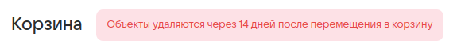

Если недавно удаленных файлов нет, то выводится сообщение "В корзине пусто".  

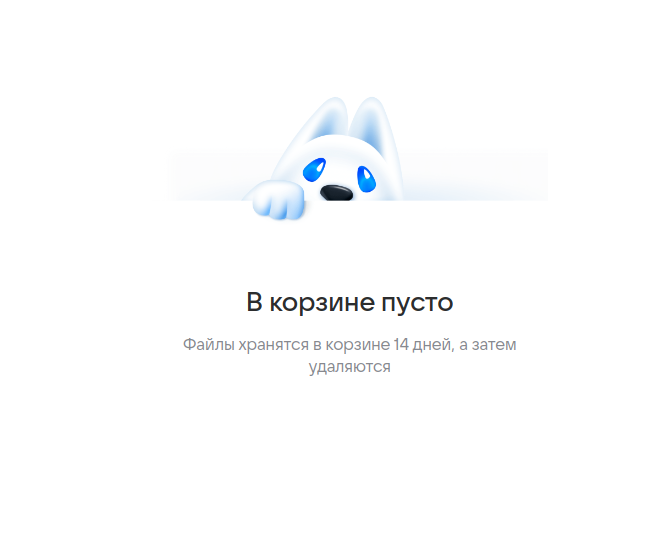

Кнопка "Выделить все" некликабельна при пустой корзине.  

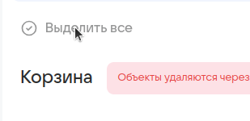

Перемещаем файл в корзину  

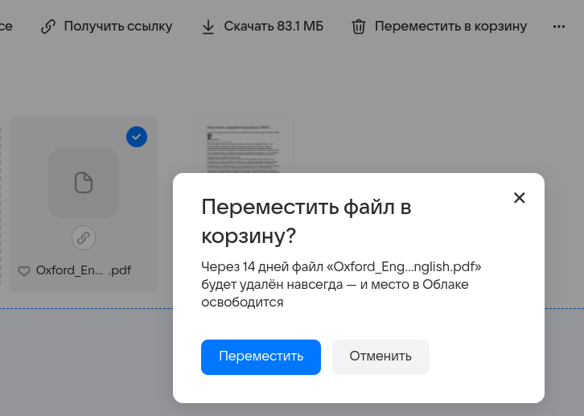

После перемещения в левом нижнем углу появляется соответствующее уведомление с возможностью перейти в корзину.  

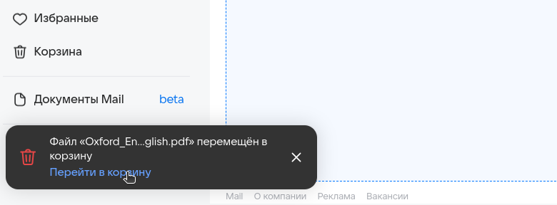

Имеем несколько файлов в корзине. У каждого из них отображается превью, имя, путь, дата и размер.  
Становятся доступны новые действия: "Восстановить все" и "Очистить корзину".  

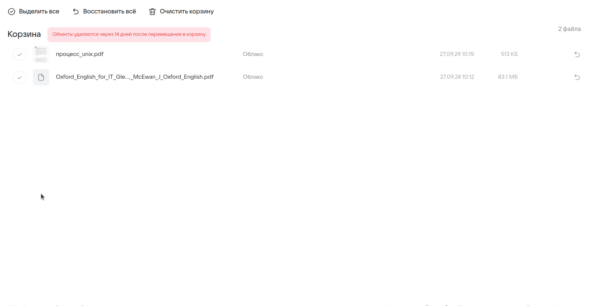 

Восстановить и выделить файл можно также с помощью круглых кнопок слева и справа в карточке файла.  

При клике на файл он выделяется. Кнопка "Восстановить всё" меняется на "Восстановить".  

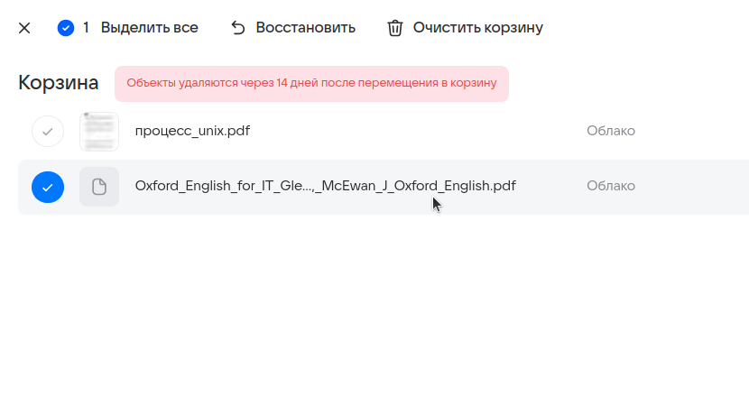

При повторном клике ничего не происходит.

Кнопки "Восстановить" в правой части файла по-прежнему кликабельны как для выделенного, так и для обычного файлов.  

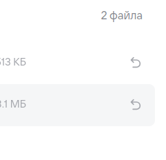

При выделении всех файлов кнопка "Выделить все" меняется на "Снять выделение".  

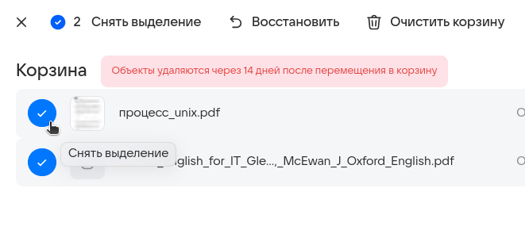

При наведении курсора на файл отображается его имя.

При попытке восстановить файл с помощью меньшей кнопки в карточке файла:  

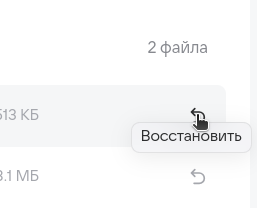 

появляется модальное окно, в котором можно выбрать, куда восстановить файл: выбрать папку или создать новую.  

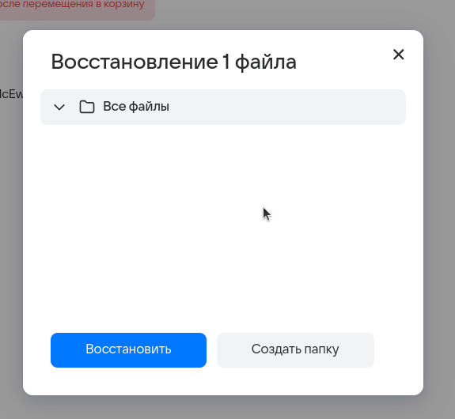

После восстановления в существующую папку появляется уведомление об успешном действии.  

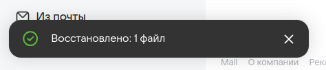

При выделении файла и клике на основную кнопку "Восстановить", расположенную сверху, получаем аналогичное поведение - модальное окно с выбором целей папки.  

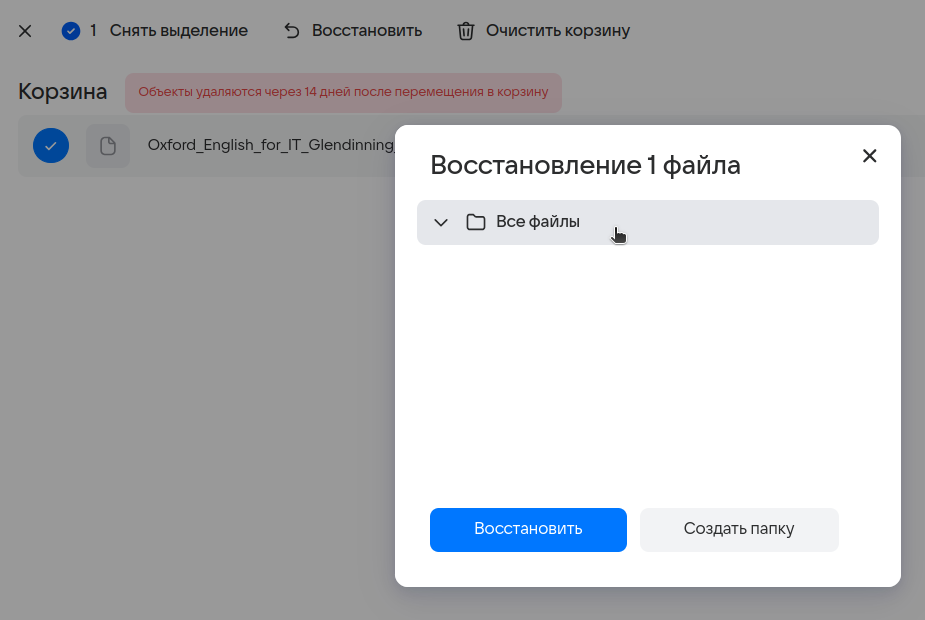

Создавая новую папку, введем слишком длинное имя.  
Появляется ошибка о превышении длины имени.  

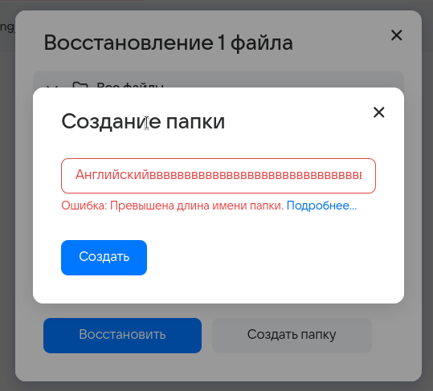

После клика на "Подробнее...", открывается страница, на которой перечислены ограничения.  
Ограничения для нейминга:  

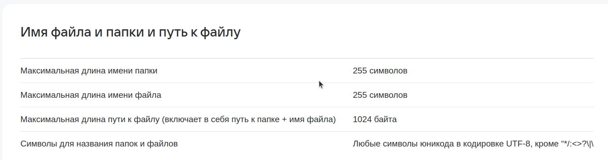

С допустимым именем получилось создать дочернюю папку.  

После нажатия на "Восстановить" получаем привычное уведомление об успешном действии.  
Переходим на "Все файлы":  

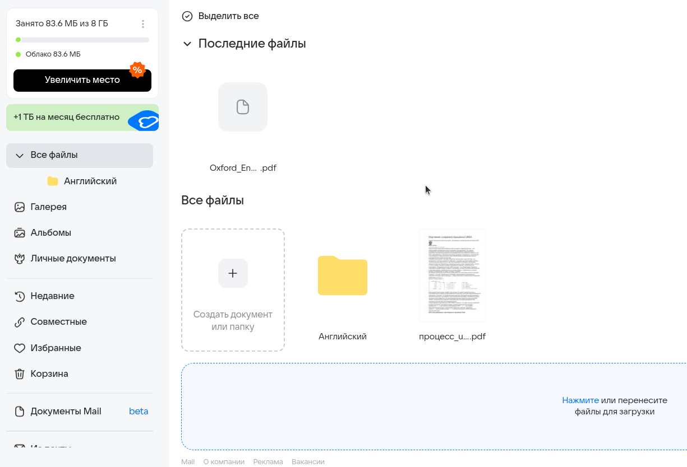

В дочерней папке "Английский" находится восстановленный файл.  

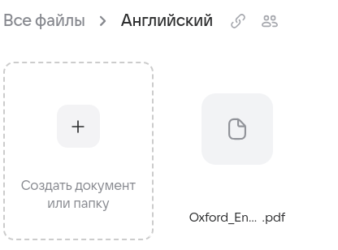

Теперь один из файлов находится в другой папке, это показано в интерфейсе  

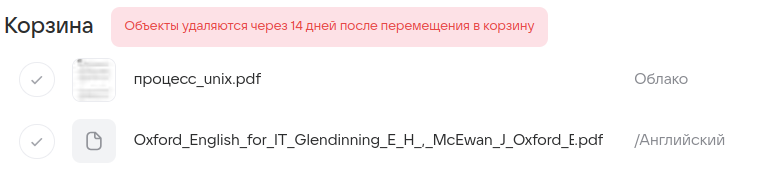

Выделяем все файлы и нажимаем "Восстановить", выбираем "Все файлы".  

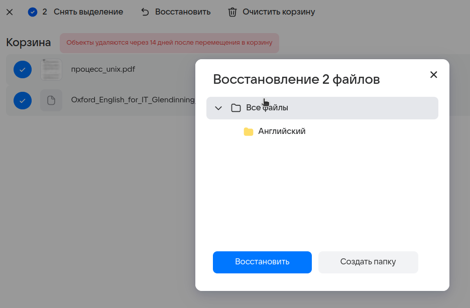

Файлы доступны в папке "Все файлы".

При нажатии "Восстановить все" файлы восстанавливаются по очереди. После успешного восстановления появляется соответствующее уведомление.  

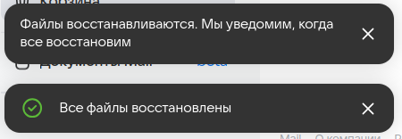

При восстановлении таким способом окно для выбора папки не появляется, файлы восстанавливаются в папки, в которых они находились до помещения в корзину.

Нет возможности удалить отдельный файл. Даже при выделении одного файла кнопка "Очистить корзину" не меняется, а при нажатии на нее, появляется модальное окно с подтверждением:  

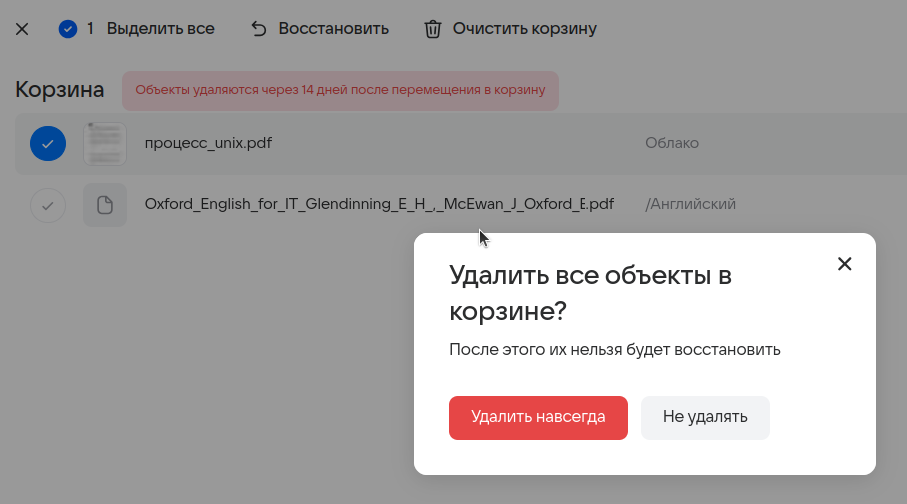

После согласия файлы удаляются.

## Совместное

При отсутствии совместных папок в центре экрана находится предложение создания папки.  

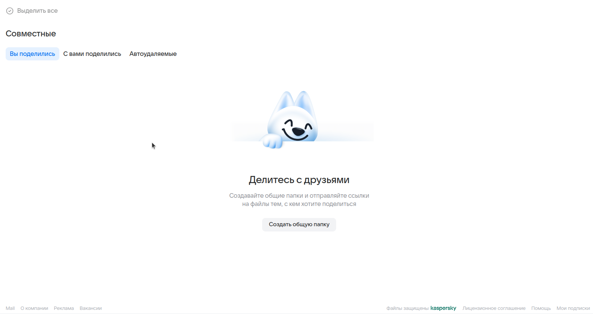

При нажатии на кнопку "Создать общую папку" появляется модальное окно с полем ввода имени папки.  

В силу ограничений на длину папки, не получается создать папку с длиной имени более 255 символов.  

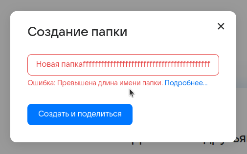

После создния появляется окно, в котором можно настроить доступ и получить ссылку.  

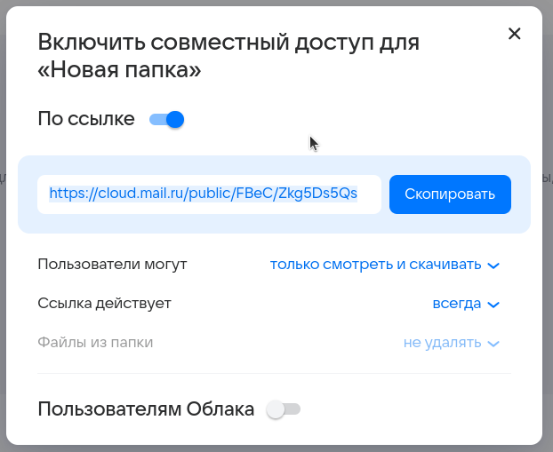

При переключении тоггла "По ссылке" папке перестает быть совместной и отображается только в файлах пользователя.  

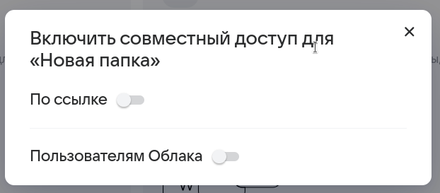

Создать совместную папку можно и другим способом: при клике правой кнопкой мыши на любую из папок, в дропдауне можно нажать "Открыть доступ по ссылке"  

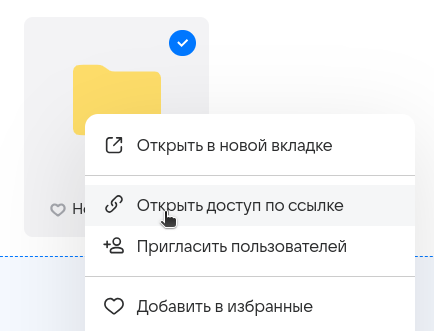

После этого появится точно такое же окно настройки доступа, как и в предыдущем способе создания.  
После создания папка появляется в разделе "Вы поделились".  

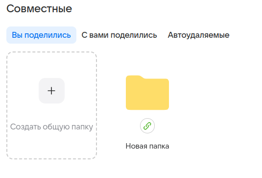

В разделе "Автоудаляемые" можно создать папку с определенным временем жизни.  

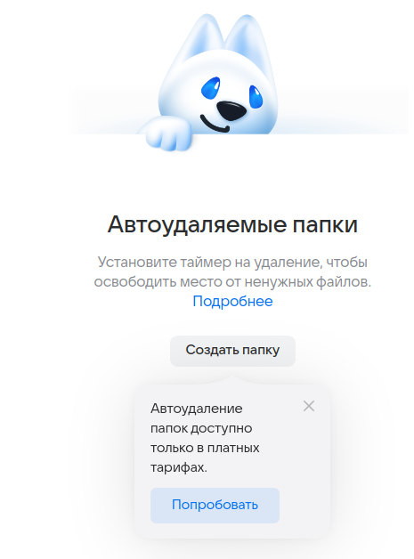

Но создание такой папки доступно только с платной подпиской на сервис.  

## Недавние

* При нажатии соответсвующей кнопки пользователь получает сортированные недавние файлы по категориям (**Изображения,Документы,Музыка,Видео**).

* В любой категории можно **загрузить файлы**.

* После загрузки файлов в соответствующей категории можно **поделиться файлом или скачать загруженные материалы**.

* А так же **выделить материал** и **поместить** его **в альбом/корзину/папку**. **Скачать или копировать выбранный материал или выделить все**.

## Авторизация

* **Авторизоваться** можно либо **по почте**, либо **по номеру телефона**.
* Авторизация возможна с помощью таких сервисов как **"Одноклассники", "Вконтаке", "Госулсуги"**, а также **войти по QR-коду**.

* Можно **восстановить доступ**.

* Можно **создать новый аккаунт**.
* При попытке создания аккаунта с длиной менее 4 или более 31 символов **выводится ошибка**.

* При попытке создания уже существующего аккаунта **выводится ошибка**.

* При вводе соответствующей почты аккаунта **возможна авторизация**.

* Авторизация возможна с помощью **VK ID или другим способом**.

* При выборе VK ID, для подтверждения **требуется ввести номер телефона**, привязанный к аккаутну.

* После чего **ввести код**, отправленный на соответсвующий номер телефона и авторизоваться.

* В случае, если телефон не доступен, можно войти **по паролю, QR-коду или восстановить доступ**.

* Вход **по QR-коду**.

* Вход **по паролю**

* **Восстановление доступа**, при попытке восстановления почты не сервиса mail выводится ошибка.

* **Восстановление доступа**.

* При попытке восстановления аккаунта с недопустимыми символами или несуществующего аккаунта **выводится ошибка**.

* Пользователь **может иметь** сразу **несколько аккаунтов**.

## Пароль и безопасность  

* На вкладке пароль и безопастность **можно посмотреть устройства и приложения** пользователя, **внешние сервисы** и **прошлые действия**.

* Просмотр приложений и устройств пользователя, а также возможность **сообщить о взломе аккаунта**.

* Пользователь **может включить и выключить доступ по почте**, а также **удалить некоторое количество сервисов**, с помощью которых был произведен вход в аккаунт по почте (например облако).

* Во вкладке прошлые действия **можно увидеть историю действий** в сервисе, а также **сообщить о взломе аккаунта** в случае, если эти действия были совершены не самим пользователем.

* На данной странице возможно **выбрать временной промежуток для просмотра истории** действий или просмотр "за сегодня", "за вчера", "за неделю", "за месяц".

* При переходе на вкладку пароли для внешних приложений открывается вкладка, на которой **можно посмотреть подробнее**, что это такое **или создать** такой **пароль**.

* **Требуется подтверждение** того, что аккаунт принадлежит пользователю.

* А также **требуется подтверждение** того, что это не робот. (Просто тыкнуть невозможно, так как обязательно нужно нажать на галочку)

* Появляется пароль для внешнего приложения, который **можно скопировать и завершить действие**.

* Удачное создание пароля внешнего приложения.

## Редактирование профиля

