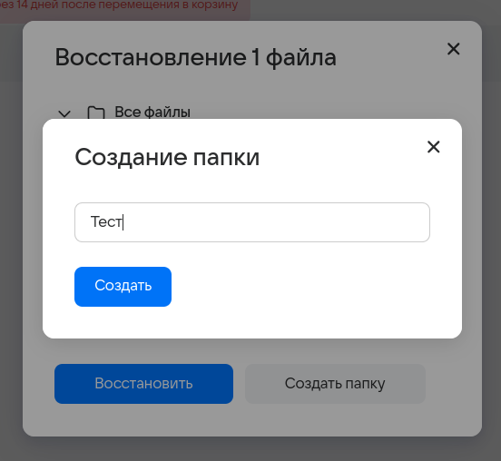
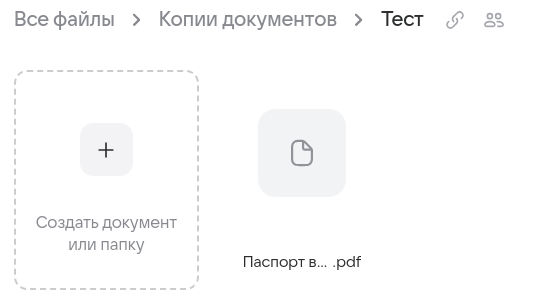
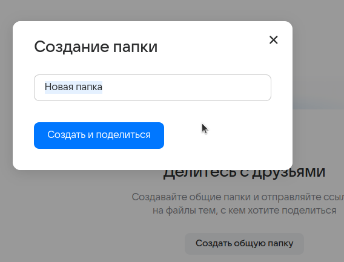
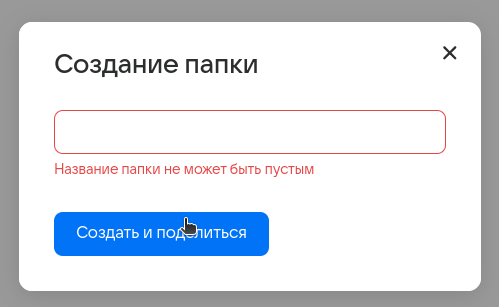
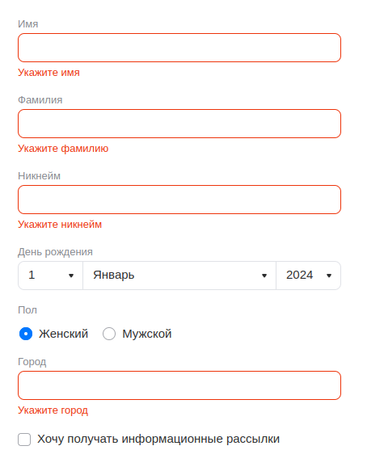
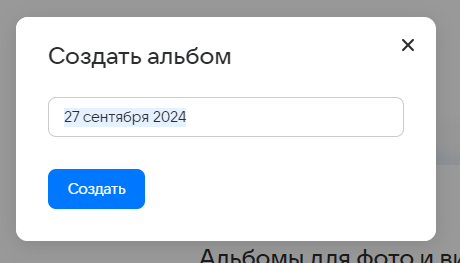
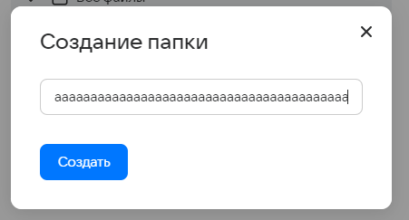
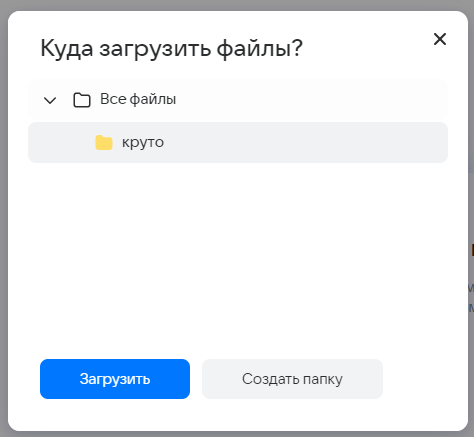

# ДЗ №1
Команда **FullFocus**

Тестируем функционал **Облака @mail** ([ссылка](https://cloud.mail.ru/)).

Разделы:  

[1. Корзина](#Корзина) 

[2. Совместное](#Совместное)  

[3. Недавние](#Недавние)

[4. Авторизация](#Авторизация)

[5. Просмотрщик](#Просмотрщик)

[6. Редактирование профиля](#Редактирование-профиля)

[7. Главная](#главная)

[8. Альбомы](#Альбомы)

[9. Галерея](#Галерея)

[10. Избранное](#Избранное)

[11. Личные документы](#Личные-документы)

## Корзина

- В левом верхнем углу отображается информация о времени хранения объектов в корзине.  

- Если недавно удаленных файлов нет, то выводится сообщение "В корзине пусто".  

- Кнопка "Выделить все" некликабельна при пустой корзине.  

- Перемещаем файл в корзину. При этом появляется алерт с подтверждением действия:  

- После перемещения в левом нижнем углу появляется соответствующее уведомление с возможностью перейти в корзину.  

- При нажатии на "Перейти в корзину" выполняется редирект на https://cloud.mail.ru/trashbin.  

- Имеем несколько файлов в корзине. У каждого из них отображается превью, имя, путь, дата и размер.  

Становятся доступны новые действия: "Восстановить все" и "Очистить корзину".  

 

- При клике на файл он выделяется. Кнопка "Восстановить всё" меняется на "Восстановить".  

При повторном клике ничего не происходит.

- Кнопки "Восстановить" в правой части файла кликабельны как для выделенного, так и для обычного файлов.  

- При нажатии на кнопку выделенного файла появляется алерт с выбором папки, куда требуется восстановить файл.  

С невыделенным файлом поведение аналогичное.  

- При выделении всех файлов по кнопке "Выделить все" эта кнопка пропадает, и вместо нее появляется "Снять выделение".  

- При наведении курсора на имя файла отображается его имя.

- При попытке восстановить файл с помощью кнопки "восстановить" в карточке файла:  

 

появляется модальное окно для выбора, куда восстановить файл: выбрать папку или создать новую.  

- После восстановления в существующую папку появляется уведомление об успешном действии.  

- При выделении файла и клике на основную кнопку "Восстановить" поднимается модальное окно создания папки.  

При восстановлении файла создадим папку, в которую нужно будет его переместить.  

После восстановления файл отображается в новой папке.  

- При удалении файла из папки в карточке файла в корзине появляется имя этой папки.  

- Выделяем все файлы и нажимаем "Восстановить", выбираем "Все файлы".  

Файлы доступны в папке "Все файлы".

- Нет возможности удалить отдельный файл. Даже при выделении одного файла кнопка "Очистить корзину" не меняется, а при нажатии на нее, появляется модальное окно с подтверждением:  

- После согласия файлы удаляются.  

- При нажатии на "Не удалять" файл остается в корзине.  

- При нажатии на крестик поведение аналогичное.  

## Совместное

- При отсутствии совместных папок в центре экрана находится предложение создания папки.  

- При нажатии на кнопку "Создать общую папку" появляется модальное окно с полем ввода имени папки.  

- В силу ограничений на длину имени папки, не получается создать папку с длиной имени более 255 символов.  

- При попытке создать папку с пустым именем появляется сообщение об ошибке.  

- После создания происходит открытие окна общего доступа в созданной папке.  

- При переключении тоггла "По ссылке" папка перестает быть совместной и отображается только в файлах пользователя.  

- Совместная папка создается кликом правой кнопки мыши на любую из папок, и кликом на "Открыть доступ по ссылке" в открывшемся окне.  

## Недавние

* При нажатии соответсвующей кнопки пользователь получает сортированные недавние файлы по категориям (**Изображения,Документы,Музыка,Видео**).

* При нажатии или переносе мы получаем возможность **загрузить файлы**.

* После загрузки файлов в соответствующей категории мы получаем возможность **поделиться файлом**.
* После загрузки файлов в соответствующей категории мы получаем возможность **скачать загруженные материалы**

* При нажатии **выделяем материал**.
* Выделенный материал есть возможность **поместить в альбом**.
* Выделенный материал есть возможность **поместить в корзину**.
* Выделенный материал есть возможность **поместить в папку**.
* Выделенный материал есть возможность**скачать**.
* Выделенный материал есть возможность **копировать**
* Есть возможность **выделить все**.

## Авторизация

* При вводе несуществующей почты выводится сообщение об ошибке

* При вводе неверного пароля выводится сообщение об ошибке

* После нажатия кнопки **восстановить доступ** происходит редирект на страницу восстановления доступа к аккаунту, где требуется ввести потчу, привязанному потеряному аккаунту.

* После нажатия кнопки **создать аккаунт** мы создаем новой аккаунт с уникальным валидным именем ящика.

* При попытке создания аккаунта с длиной менее 4 или более 31 символов **выводится ошибка**.

* При попытке создания уже существующего аккаунта **выводится ошибка**.

* При вводе соответствующей почты аккаунта **возможна авторизация**.

* **(кейс авторизации через VK ID)** При выборе VK ID, для подтверждения **требуется ввести номер телефона**, привязанный к аккаутну.  После чего **ввести код**, отправленный на соответсвующий номер телефона и авторизоваться.

* В случае, если телефон не доступен, можно войти **по паролю, QR-коду или восстановить доступ**.

* Вход **по QR-коду**.

* Вход **по паролю**

  

* После нажатия кнопки **Восстановление доступа** происходит редирект на страницу восстановления доступа.

* **Восстановление доступа**, при попытке восстановления почты не сервиса mail выводится ошибка.

* При попытке восстановления аккаунта с недопустимыми символами **выводится ошибка**.
* При попытке восстановления аккаунта с несуществующего аккаунта **выводится ошибка**.

* Пользователь **может иметь** сразу **несколько аккаунтов**.

## Просмотрщик

* Для того, чтобы попасть в режим просмотра любого мультимедиа требуется на него **дважды кликнуть**.

* После нажатия на кнопку "получить ссылку" мы **получам ссылку на материал**.
* После нажатия на кнопку  "скачать файл" мы **скачиваем материал**.
* После нажатия на кнопку "Добавить в избранное" мы **добавляем материал в избранное**.
* После нажатия на значок корзины мы **удаляем материал**.

* После нажатия на кнопку **получить ссылку** и **скопировать ссылку** мы получаем ссылку в модальном окне.
* После нажатия на кнопку **получить ссылку** в дропдауне есть возможность установить длительность действия ссылки (час, день, неделя и тд).
* **Отключить доступ по ссылке** к материалу

* После нажатия на троеточие и на кнопку **Показать в папке** и материалы папки будут видны.
* После нажатия на троеточие и на кнопку **Копировать** мы копируем материал.
* После нажатия на троеточие и на кнопку  **Переместить в папку** мы перемещаем материал в папку.
* После нажатия на троеточие и на кнопку **Отправить по почте** мы отправляем материал по почте.

* После нажатия удаления материала при нажатии **подтвердить удаление или отменить действие** совершаем выбранное в модальном окне.

* После нажатия на кнопку добавить в избранное кнопка меняется и **материал добавляется в избранное**. 

* После нажатия на кнопку копирования и нажатия на кнопку "скопировать" мы **копируем файл** в модальном окне.

* После нажатия на кнопку копирования и нажатия на кнопку "создать папку" мы **создаем папку** в модальном окне.
* После нажатия на кнопку копирования и нажатия на кнопку "скопировать" мы **коопировать файл в созданную папку** в модальном окне.

* После нажатия на кнопку "Переместить в папку" и нажатия кнопки "переместить" мы **перемещаем материал** в модальном окне.

* После нажатия на кнопку "Переместить в папку" и нажатия кнопки "создать папку" мы **создем папку** в модальном окне.
* После нажатия на кнопку "Переместить в папку" и нажатия кнопки "переместить" мы **перемещаем материал в созданную папку** в модальном окне.

* После нажатия на кнопку **отправить по почте** происходит редирект на страницу отправки письма с выбранным материалом.

* При просмотре файла видеоформата и нажатия кнопки воспроизведения мы **воспроизводим запись**.
* При просмотре файла видеоформата и нажатия кнопок перемотки мы **перематываем запись на 10 секунд**

* Редактировать **качество**.
* Редактировать **скорость воспроизведения**.
* Редактировать **громкость**
* Сделать видео **во весь экран**

* При просмотре файла формата pdf в iframe и нажатия на кнопку принтера мы **печатаем файл**.
* При просмотре файла формата pdf в iframe и нажатия на кнопку масштабирования мы **изменяем масштаб**.
* При просмотре файла формата pdf в iframe и нажатия на кнопку поворота мы **поворачиваем файл по часовой стрелке**.

* При просмотре файла формата pdf в iframe и нажатия на кнопку "Свойства документа" мы **открываем свойства документа**.
* При просмотре файла формата pdf в iframe и нажатия на кнопку "Двухстраничный режим" мы  **устанавливаем двухстраничный режим**.
* При просмотре файла формата pdf в iframe и нажатия на кнопку "Заметки" мы **устанавливаем режим заметок**.

* После нажатия на кнопку мы переходим **в полноэкранный режим**.

* **Перейти на следующий или предыдущий файл** при наличии соседних файлов нажатием кнопки или соответствующим свайпом.
  

* После нажатия на крестик мы **закрываем "просмотрщик"**.

## Редактирование профиля

* На странице профиля кратко указаны данные о пользователе, а так же элементы для навигации и редактирования.

* Для перехода к редактированию профиля необходимо перейти в **настройки личных данных** или во вкладку **личные данные** на навигационной панели слева.

* В разделе **личные данные** содержится основная информация о профиле, а так же функционал для его редактирования.

* Изменения в имени, фамилии, никнейме и городе подразумевают пользовательский ввод. После изменения данных нужно нажать синюю кнопку **сохранить**. Никаких сообщений об успешном сохранении изменений нет, ориентироваться приходиться только по имени и фото в левой части экрана.

* Кнопка **отменить** возвращает на главную страницу профиля.

* Информационное сообщение о том, какие поля нельзя оставлять пустими.

* В имени, фамилии и никнейме допускается использование широкого набора символов, в том числе и некоторых специальных. Пример успешного сохранения изменений:

* При попытке ввести символы из набора *[<, >, ", :]* или превысить длину в 40 символов, появляется сообщение о некоректности ввода:

* При вводе названия города, приложение подсказывает названия выпадающим списком, ориентируясь на введенные буквы. 

* Если ввести название несуществующего города, появится сообщение об ошибке.

* Для изменения фотографии профиля достаточно нажать на кнопку **изменить фото** или нажать на само фото профиля.

* Открывается окно выбора файла для фото профиля.

* После загрузки появляется окно для позиционирования новой фотографии. Можно **сохранить** или **отменить** изменения.

* При успехе новая фотография устанавливается вместо предыдущей.

* При выборе фото нужно учитывать его размеры, о чем сообщает приложение при попытке загрузки очень маленького изображения:

## Главная

* На главной странице расположено пространство с файлами и папками, хранящимися на облаке:

* Навигационная панель для перехода к другим сервисам *VK*. При нажатии на кнопку сервиса, он открывается в новой вкладке браузера:

* Навигационная панель слева служит для просмотра текущей загруженности облака, для навигации по своим папкам, дле перехода в разделы **галерея**, **альбомы**, **личные документы**, **недавние**, **совместные**, **избранные**, **корзина**, **документы mail**, **из почты**.

* В правом верхнем углу можно нажать на свою аватарку и полуить доступ к **управлению профилем**, **управлению несколькими аккаунтами**, **настройкам безопасности**

* В верхней части страница располагается поисковая строка для поиска по файлам и папкам в облаке пользователя

* Можно настраивать параметры поиска:

* Если поиск успешен и были найдены объеты облака (*файлы*, *папки*, *документы*, *таблицы*), то они появляются в главном окне:

* Если найти файлы не удалось, появляется сообщение об отсутствии результатов:

* Для создания **папки**, **таблицы** или **документа** нужно нажать в соответсвующее место в центре экрана:

* При создании **документа** происходит перенаправление в отдельную вкладку с приложением *офис документы*:

* При создании **таблицы** происходит перенаправление в отдельную вкладку с приложением *офис документы*:

* При  создании папки открывается модальное окно для задания имени:

* Если не указать имя папки, появляется сообщение об ошибке:

* Для загрузки нового файла или папки нужно нажать на большую область голубого цвета внизу страницы или на кнопку *плюс* в правом нижнем углу страницы. Откроется выбор файлов, которые можно перетащить в пространство облака или постепенно прокликать.

* В случае успешной загрузки снизу появляется *уведомление*

* Любой файл или папку в облаке можно
1. **скачать**, если нажать на кнопку для загрузки в правом верхнем углу карточки файла
2. **добавить в избранное**, если нажать на кнопку сердечка рядом с именем файла
3. **выделить**, если нажать в любое место карточки
4. **поделиться ссылкой**, если нажать на значок цепи в середине карточки

* Расширенный список операций доступен для выделенных файлов

* В правой части экрана находятся еще 2 кнопки для изменения отображенния и применения сортировки

* Отображение **списком**

* Отображение **таблицей**

* При нажатии правой кнопкой мыши в любое свободное место облака, появляется альтернативное окно со всеми описанными выше возможностями

## Альбомы

* если альбомов ещё нет, то на странице появляется соответствующее сообщение с подсказкой  
    
* нажатие на кнопку “Создать альбом” открывает модальное для выбора названия; введенное по умолчанию название соответствует дате создания альбома  
    
* нельзя в качестве названия выбрать пустую строку  
    
* есть ограничение на максимальную длину названия (255 символов)  
    
* есть проверка на недопустимые символы  
    
* при создании нового альбома открывается модальное окно для добавления новых фотографий, хранящихся в облаке; если таких фотографий ещё нет, то отображается соответствующая подсказка  
    
* созданный альбом отображается в списке альбомов  
    
* клик на альбом открывает его; если данный альбом пуст, то в нем отображаются подсказки для добавления в него новых изображений  
    
* нажатие на “Загрузить с компьютера” открывает проводник для выбора изображений на устройстве
* нажатие на “Выбрать с облака” открывает меню для выбора изображений, загруженных в облако
* при отсутствии выбора на кнопку “Добавить в альбом” нельзя нажать  
    
* можно выбрать произвольное число изображений для добавления в альбом; кнопка “Добавить в альбом” теперь активна  
    
* кнопка “Посмотреть выбранные” открывает список выбранных изображений  
    
* нажатие на выбранную картинку снимает выделение
* можно просмотреть фотографии, загруженные с компьютера и с телефона отдельно
* если выбрать вкладку, в которой фотографий не окажется, то интерфейс выбора изображений частично пропадет \- не очень удобно (пример: здесь я открыл вкладку “С телефона”, которой пока что не соответствует ни одна фотография)  
    
* кнопка “Выбрать все” выделяет все картинки, изображенные на данные момент  
    
* кнопка “Снять выделение” снимает выделение со всех картинок
* переключение между вкладками снимает выделение \- не очень удобно
* нажатие на поиск открывает поле ввода поиска и кнопку фильтров  
    
* нажатие на “Найти” осуществляет поиск картинок по названию  
    
* введенная строка должна быть хотя бы подстрокой названия, чтобы картинка была найдена, регистр не учитывается (пример: данное изображение можно найти, введя в поиске “мопс”, “оп”, “оПс”, “м”, “МО”, “моП”, “с” и так далее)  
    
* если поиск ничего не нашел, то будет выведено соответствующее сообщение  
    
* если в поле ввода поиска есть какой-то текст, то кнопка крестика удалит его; если же поле ввода пустое, то поиск закроется
* кнопка “Фильтр” позволяет искать изображения и видео отдельно
* возможен поиск с пустой строкой (будут показаны все изображения)
* кнопка “Добавить” добавляет выбранные файлы в альбом и открывает его

## Галерея

* если загруженных изображений ещё нет, то на странице появляется соответствующее сообщение с подсказкой  
    
* наведение на кнопку “Загрузить” открывает меню с выбором вариантов для загрузки изображения или целой папки  
    
* при выборе “Загрузить файлы” можно выбрать несколько файлов  
    
* при выборе “Загрузить папку” можно выбрать папку для загрузки  
    
* можно перенести файлы из проводника в соответствующую зону на экране, чтобы началась загрузка
* при загрузке файлов можно выбрать местоположение на диске, где они будут сохранены  
    
* если нужной папки нет, её можно создать нажатием на “Создать папку” (значение по умолчанию \- “Новая папка”)  
    
* нельзя оставить пустую строку в качестве названия  
    
* есть ограничение на максимальную длину названия (255 символов)  
    
* есть проверка на недопустимые символы  
    
* созданная папка отображается  
    
* процесс загрузки можно наблюдать в правом нижнем углу (баг: загрузка начинается сразу и останавливается, пока не будет выбрано местоположение для файла; из\-за этого время загрузки отображается большим, чем на самом деле)  
    
* загрузку изображений можно остановить
* загруженные изображения можно просмотреть в галерее  
    
* нажатие на картинку откроет меню её просмотра  
    
* нажатие на “Поделиться ссылкой” открывает модальное окно с настройкой совместного доступа  
    
* у файлов, которыми поделились, отображается соответствующий значок

## Избранное

* нажатие на значок сердца у файла или папки добавляет его в избранное (значок отображается при наведении)  
    
* нажатие правой кнопкой мыши на нужный файл или папку и выбор “Добавить в избранное” добавляет выбранный элемент в избранное  
    
* в разделе “Последние файлы” значок для добавления в избранное не отображается \- неудобно  
    
* в избранном отображаются добавленные в избранное файлы и папки  
    
* нажатие на красный значок сердца убирает файл или папку из избранного  
    

## Личные документы

- В личных документах находятся формы для загрузки различных документов.  
Также на этой странице можно запустить распознавание документов (в верхней части окна) нажатием кнопки.  

- При наведении на форму появляется текст, а после нажатия предлагается выбрать файл для загрузки.  

- После выбора файла в левом нижнем углу появляется уведомление об успешной загрузке.  

- При загрузке файла в правом нижнем углу отображается прогресс-бар и сообщение об успехе операции.  

С помощью кнопок в этом окне можно:
1. Поделиться ссылкой на загруженный файл (по аналогии с совместными файлами):  

2. Свернуть окно  
3. Закрыть окно  
4. "Загрузить еще", выбрав дополнительные файлы для загрузки.  

- При попытке загрузить такой же файл появляется ошибка о одинаковых именах файлов.  

- Если выбрать "Переименовать", то имя файла изменится на `<предыдущее_имя> + ' (1)'` и он будет успешно загружен.  

- Если выбрать "Заменить", то в загрузках появится 3-й файл (правый нижний угол), но файлов будет по-прежнему 2, файл действительно был заменен более новой версией.  

- Если выбрать "Пропустить", то файл не загрузится и отобразится в загрузках с тултипом **i**, при клике на который появляется сообщение об ошибке.  

- На странице каждого вида документа в правом нижнем углу находится кнопка "Загрузить":  

- При наведении на него появляется небольшое окно с выбором, что загрузить: папку или файл.  

- После загрузки документов формы незагруженных документов помещаются после загруженных.  

- При двойном клике на загруженный файл с паспортом документ открывается в редакторе.  

В верхней части окна появляются следующие кнопки:  

- При клике правой кнопкой мыши становятся доступны действия над файлом.  

- При перемещении в корзину файл действительно попадает в нее.  

  

- Но после восстановления файл попадает в папку "Все файлы / Копии документов", а не в документы.  

В разделе "Паспорт" теперь нет документов.  

  

