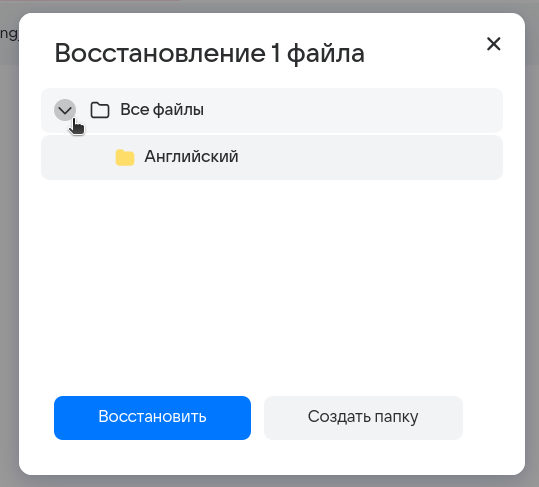

# ДЗ №1
Команда **FullFocus**

Тестируем функцониал **Облака @mail** ([ссылка](https://cloud.mail.ru/)).

## Корзина

В левом верхнем углу отображается информация о времени хранения объектов в корзине.

Если недавно удаленных файлов нет, то выводится сообщение "В корзине пусто".

Кнопка "Выделить все" некликабельна при пустой корзине.

Перемещаем файл в корзину

После перемещения в левом нижнем углу появляется соответствующее уведомление с возможностью перейти в корзину.

Имеем несколько файлов в корзине. У каждого из них отображается превью, имя, путь, дата и размер.  
Становятся доступны новые действия: "Восстановить все" и "Очистить корзину".
 

Восстановить и выделить файл можно также с помощью круглых кнопок слева и справа в карточке файла.

При клике на файл он выделяется. Кнопка "Восстановить всё" меняется на "Восстановить"

При повторном клике ничего не происходит.

Кнопки "Восстановить" в правой части файла по-прежнему кликабельны как для выделенного, так и для обычного файлов.

При выделении всех файлов кнопка "Выделить все" меняется на "Снять выделение".

При наведении курсора на файл отображается его имя.

При попытке восстановить файл с помощью меньшей кнопки в карточке файла:  
 

появляется модальное окно, в котором можно выбрать, куда восстановить файл: выбрать папку или создать новую.

После восстановления в существующую папку появляется уведомление об успешном действии.

При выделении файла и клике на основную кнопку "Восстановить", расположенную сверху, получаем аналогичное поведение - модальное окно с выбором целей папки.

Создавая новую папку, введем слишком длинное имя.  
Появляется ошибка о превышении длины имени.

После клика на "Подробнее...", открывается страница, на которой перечислены ограничения.  
Ограничения для нейминга:  

С допустимым именем получилось создать дочернюю папку.

После нажатия на "Восстановить" получаем привычное уведомление об успешном действии.  
Переходим на "Все файлы":

В дочерней папке "Английский" находится восстановленный файл.

Теперь один из файлов находится в другой папке, это показано в интерфейсе

Выделяем все файлы и нажимаем "Восстановить", выбираем "Все файлы".

Файлы доступны в папке "Все файлы".

При нажатии "Восстановить все" файлы восстанавливаются по очереди. После успешного восстановления появляется соответствующее уведомление.

При восстановлении таким способом окно для выбора папки не появляется, файлы восстанавливаются в папки, в которых они находились до помещения в корзину.

Нет возможности удалить отдельный файл. Даже при выделении одного файла кнопка "Очистить корзину" не меняется, а при нажатии на нее, появляется модальное окно с подтверждением:

После согласия файлы удаляются.

## Совместное

## Редактирование профиля

