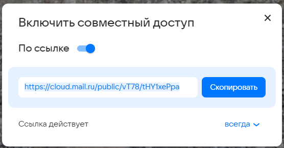

# ДЗ №1
Команда **FullFocus**

Тестируем функционал **Облака @mail** ([ссылка](https://cloud.mail.ru/)).

Разделы:  

[1. Корзина](#Корзина) 

[2. Совместное](#Совместное)  

[3. Недавние](#Недавние)

[4. Авторизация](#Авторизация)

[5. Пароль и безопасноть](#пароль-и-безопасность)

[6. Редактирование профиля](#Редактирование-профиля)

[7. Главная](#главная)

[8. Альбомы](#Альбомы)

[9. Галерея](#Галерея)

[10. Избранное](#Избранное)

[11. Личные документы](#Личные-документы)

## Корзина

В левом верхнем углу отображается информация о времени хранения объектов в корзине.  

Если недавно удаленных файлов нет, то выводится сообщение "В корзине пусто".  

Кнопка "Выделить все" некликабельна при пустой корзине.  

Перемещаем файл в корзину  

После перемещения в левом нижнем углу появляется соответствующее уведомление с возможностью перейти в корзину.  

Имеем несколько файлов в корзине. У каждого из них отображается превью, имя, путь, дата и размер.  
Становятся доступны новые действия: "Восстановить все" и "Очистить корзину".  

 

Восстановить и выделить файл можно также с помощью круглых кнопок слева и справа в карточке файла.  

При клике на файл он выделяется. Кнопка "Восстановить всё" меняется на "Восстановить".  

При повторном клике ничего не происходит.

Кнопки "Восстановить" в правой части файла по-прежнему кликабельны как для выделенного, так и для обычного файлов.  

При выделении всех файлов кнопка "Выделить все" меняется на "Снять выделение".  

При наведении курсора на файл отображается его имя.

При попытке восстановить файл с помощью меньшей кнопки в карточке файла:  

 

появляется модальное окно, в котором можно выбрать, куда восстановить файл: выбрать папку или создать новую.  

После восстановления в существующую папку появляется уведомление об успешном действии.  

При выделении файла и клике на основную кнопку "Восстановить", расположенную сверху, получаем аналогичное поведение - модальное окно с выбором целей папки.  

Создавая новую папку, введем слишком длинное имя.  
Появляется ошибка о превышении длины имени.  

После клика на "Подробнее...", открывается страница, на которой перечислены ограничения.  
Ограничения для нейминга:  

С допустимым именем получилось создать дочернюю папку.  

После нажатия на "Восстановить" получаем привычное уведомление об успешном действии.  
Переходим на "Все файлы":  

В дочерней папке "Английский" находится восстановленный файл.  

Теперь один из файлов находится в другой папке, это показано в интерфейсе  

Выделяем все файлы и нажимаем "Восстановить", выбираем "Все файлы".  

Файлы доступны в папке "Все файлы".

При нажатии "Восстановить все" файлы восстанавливаются по очереди. После успешного восстановления появляется соответствующее уведомление.  

При восстановлении таким способом окно для выбора папки не появляется, файлы восстанавливаются в папки, в которых они находились до помещения в корзину.

Нет возможности удалить отдельный файл. Даже при выделении одного файла кнопка "Очистить корзину" не меняется, а при нажатии на нее, появляется модальное окно с подтверждением:  

После согласия файлы удаляются.

## Совместное

При отсутствии совместных папок в центре экрана находится предложение создания папки.  

При нажатии на кнопку "Создать общую папку" появляется модальное окно с полем ввода имени папки.  

В силу ограничений на длину папки, не получается создать папку с длиной имени более 255 символов.  

После создния появляется окно, в котором можно настроить доступ и получить ссылку.  

При переключении тоггла "По ссылке" папке перестает быть совместной и отображается только в файлах пользователя.  

Создать совместную папку можно и другим способом: при клике правой кнопкой мыши на любую из папок, в дропдауне можно нажать "Открыть доступ по ссылке"  

После этого появится точно такое же окно настройки доступа, как и в предыдущем способе создания.  
После создания папка появляется в разделе "Вы поделились".  

В разделе "Автоудаляемые" можно создать папку с определенным временем жизни.  

Но создание такой папки доступно только с платной подпиской на сервис.  

## Недавние

* При нажатии соответсвующей кнопки пользователь получает сортированные недавние файлы по категориям (**Изображения,Документы,Музыка,Видео**).

* В любой категории можно **загрузить файлы**.

* После загрузки файлов в соответствующей категории можно **поделиться файлом**.
* После загрузки файлов в соответствующей категории можно **скачать загруженные материалы**

* Можно **выделить материал**.
* Можно выделенный материал **поместить в альбом**.
* Можно выделенный материал **поместить в корзину**.
* Можно выделенный материал **поместить в папку**.
* Можно выделенный материал **скачать**.
* Можно выделенный материал **копировать**
* Можно **выделить все**.

## Авторизация

* **Авторизоваться** можно **по почте**.
* **Авторизоваться** можно **по номеру телефона**.
* Отображение кнопок авторизации через сторонние сервисы такие как **"Одноклассники", "Вконтаке", "Госулсуги"**
* Авторизация возможна **по QR-коду**.

* После нажатия кнопки **восстановить доступ** происходит редирект на страницу восстановления доступа к аккаунту, где требуется ввести потчу, привязанному потеряному аккаунту.

* Посое нажатия кнопки **создать аккаунт** появляется возможность создания нового аккаунта с уникальным валидным именем ящика.
* При попытке создания аккаунта с длиной менее 4 или более 31 символов **выводится ошибка**.

* При попытке создания уже существующего аккаунта **выводится ошибка**.

* При вводе соответствующей почты аккаунта **возможна авторизация**.

* При выборе VK ID, для подтверждения **требуется ввести номер телефона**, привязанный к аккаутну.  После чего **ввести код**, отправленный на соответсвующий номер телефона и авторизоваться.

* В случае, если телефон не доступен, можно войти **по паролю, QR-коду или восстановить доступ**.

* Вход **по QR-коду**.

* Вход **по паролю**

  

* После нажатия кнопки **Восстановление доступа** происходит редирект на страницу восстановления доступа.

* **Восстановление доступа**, при попытке восстановления почты не сервиса mail выводится ошибка.

* При попытке восстановления аккаунта с недопустимыми символами **выводится ошибка**.
* При попытке восстановления аккаунта с несуществующего аккаунта **выводится ошибка**.

* Пользователь **может иметь** сразу **несколько аккаунтов**.

## Пароль и безопасность  

* На вкладке пароль и безопастность **можно посмотреть устройства и приложения** пользователя, **внешние сервисы** и **прошлые действия**.

* Просмотр приложений и устройств пользователя, а также возможность **сообщить о взломе аккаунта**.

* Пользователь **может включить и выключить доступ по почте**, а также **удалить некоторое количество сервисов**, с помощью которых был произведен вход в аккаунт по почте (например облако).

* Во вкладке прошлые действия **можно увидеть историю действий** в сервисе, а также **сообщить о взломе аккаунта** в случае, если эти действия были совершены не самим пользователем.

* На данной странице возможно **выбрать временной промежуток для просмотра истории** действий или просмотр "за сегодня", "за вчера", "за неделю", "за месяц".

* При переходе на вкладку пароли для внешних приложений открывается вкладка, на которой **можно посмотреть подробнее**, что это такое **или создать** такой **пароль**.

* **Требуется подтверждение** того, что аккаунт принадлежит пользователю.

* А также **требуется подтверждение** того, что это не робот. (Просто тыкнуть невозможно, так как обязательно нужно нажать на галочку)

* Появляется пароль для внешнего приложения, который **можно скопировать и завершить действие**.

* Удачное создание пароля внешнего приложения.

## Редактирование профиля

* На странице профиля кратко указаны данные о пользователе, а так же элементы для навигации и редактирования.

* Для перехода к редактированию профиля необходимо перейти в **настройки личных данных** или во вкладку **личные данные** на навигационной панели слева.

* В разделе **личные данные** содержится основная информация о профиле, а так же функционал для его редактирования.

* Изменения в имени, фамилии, никнейме и городе подразумевают пользовательский ввод. После изменения данных нужно нажать синюю кнопку **сохранить**. Никаких сообщений об успешном сохранении изменений нет, ориентироваться приходиться только по имени и фото в левой части экрана.

* Кнопка **отменить** возвращает на главную страницу профиля.

* Информационное сообщение о том, какие поля нельзя оставлять пустими.

* В имени, фамилии и никнейме допускается использование широкого набора символов, в том числе и некоторых специальных. Пример успешного сохранения изменений:

* При попытке ввести символы из набора *[<, >, ", :]* или превысить длину в 40 символов, появляется сообщение о некоректности ввода:

* При вводе названия города, приложение подсказывает названия выпадающим списком, ориентируясь на введенные буквы. 

* Если ввести название несуществующего города, появится сообщение об ошибке.

* Для изменения фотографии профиля достаточно нажать на кнопку **изменить фото** или нажать на само фото профиля.

* Открывается окно выбора файла для фото профиля.

* После загрузки появляется окно для позиционирования новой фотографии. Можно **сохранить** или **отменить** изменения.

* При успехе новая фотография устанавливается вместо предыдущей.

* При выборе фото нужно учитывать его размеры, о чем сообщает приложение при попытке загрузки очень маленького изображения:

## Главная

* На главной странице расположено пространство с файлами и папками, хранящимися на облаке:

* Навигационная панель для перехода к другим сервисам *VK*. При нажатии на кнопку сервиса, он открывается в новой вкладке браузера:

* Навигационная панель слева служит для просмотра текущей загруженности облака, для навигации по своим папкам, дле перехода в разделы **галерея**, **альбомы**, **личные документы**, **недавние**, **совместные**, **избранные**, **корзина**, **документы mail**, **из почты**.

* В правом верхнем углу можно нажать на свою аватарку и полуить доступ к **управлению профилем**, **управлению несколькими аккаунтами**, **настройкам безопасности**

* В верхней части страница располагается поисковая строка для поиска по файлам и папкам в облаке пользователя

* Можно настраивать параметры поиска:

* Если поиск успешен и были найдены объеты облака (*файлы*, *папки*, *документы*, *таблицы*), то они появляются в главном окне:

* Если найти файлы не удалось, появляется сообщение об отсутствии результатов:

* Для создания **папки**, **таблицы** или **документа** нужно нажать в соответсвующее место в центре экрана:

* При создании **документа** происходит перенаправление в отдельную вкладку с приложением *офис документы*:

* При создании **таблицы** происходит перенаправление в отдельную вкладку с приложением *офис документы*:

* При  создании папки открывается модальное окно для задания имени:

* Если не указать имя папки, появляется сообщение об ошибке:

* Для загрузки нового файла или папки нужно нажать на большую область голубого цвета внизу страницы или на кнопку *плюс* в правом нижнем углу страницы. Откроется выбор файлов, которые можно перетащить в пространство облака или постепенно прокликать.

* В случае успешной загрузки снизу появляется *уведомление*

* Любой файл или папку в облаке можно
1. **скачать**, если нажать на кнопку для загрузки в правом верхнем углу карточки файла
2. **добавить в избранное**, если нажать на кнопку сердечка рядом с именем файла
3. **выделить**, если нажать в любое место карточки
4. **поделиться ссылкой**, если нажать на значок цепи в середине карточки

* Расширенный список операций доступен для выделенных файлов

* В правой части экрана находятся еще 2 кнопки для изменения отображенния и применения сортировки

* Отображение **списком**

* Отображение **таблицей**

* При нажатии правой кнопкой мыши в любое свободное место облака, появляется альтернативное окно со всеми описанными выше возможностями

## Альбомы

* если альбомов ещё нет, то на странице появляется соответствующее сообщение с подсказкой  
    
* нажатие на кнопку “Создать альбом” открывает модальное для выбора названия; введенное по умолчанию название соответствует дате создания альбома  
    
* нельзя в качестве названия выбрать пустую строку  
    
* есть ограничение на максимальную длину названия (255 символов)  
    
* есть проверка на недопустимые символы  
    
* при создании нового альбома открывается модальное окно для добавления новых фотографий, хранящихся в облаке; если таких фотографий ещё нет, то отображается соответствующая подсказка  
    
* созданный альбом отображается в списке альбомов  
    
* клик на альбом открывает его; если данный альбом пуст, то в нем отображаются подсказки для добавления в него новых изображений  
    
* нажатие на “Загрузить с компьютера” открывает проводник для выбора изображений на устройстве
* нажатие на “Выбрать с облака” открывает меню для выбора изображений, загруженных в облако
* при отсутствии выбора на кнопку “Добавить в альбом” нельзя нажать  
    
* можно выбрать произвольное число изображений для добавления в альбом; кнопка “Добавить в альбом” теперь активна  
    
* кнопка “Посмотреть выбранные” открывает список выбранных изображений  
    
* нажатие на выбранную картинку снимает выделение
* можно просмотреть фотографии, загруженные с компьютера и с телефона отдельно
* если выбрать вкладку, в которой фотографий не окажется, то интерфейс выбора изображений частично пропадет \- не очень удобно (пример: здесь я открыл вкладку “С телефона”, которой пока что не соответствует ни одна фотография)  
    
* кнопка “Выбрать все” выделяет все картинки, изображенные на данные момент  
    
* кнопка “Снять выделение” снимает выделение со всех картинок
* переключение между вкладками снимает выделение \- не очень удобно
* нажатие на поиск открывает поле ввода поиска и кнопку фильтров  
    
* нажатие на “Найти” осуществляет поиск картинок по названию  
    
* введенная строка должна быть хотя бы подстрокой названия, чтобы картинка была найдена, регистр не учитывается (пример: данное изображение можно найти, введя в поиске “мопс”, “оп”, “оПс”, “м”, “МО”, “моП”, “с” и так далее)  
    
* если поиск ничего не нашел, то будет выведено соответствующее сообщение  
    
* если в поле ввода поиска есть какой-то текст, то кнопка крестика удалит его; если же поле ввода пустое, то поиск закроется
* кнопка “Фильтр” позволяет искать изображения и видео отдельно
* возможен поиск с пустой строкой (будут показаны все изображения)
* кнопка “Добавить” добавляет выбранные файлы в альбом и открывает его

## Галерея

* если загруженных изображений ещё нет, то на странице появляется соответствующее сообщение с подсказкой  
    
* наведение на кнопку “Загрузить” открывает меню с выбором вариантов для загрузки изображения или целой папки  
    
* при выборе “Загрузить файлы” можно выбрать несколько файлов  
    
* при выборе “Загрузить папку” можно выбрать папку для загрузки  
    
* можно перенести файлы из проводника в соответствующую зону на экране, чтобы началась загрузка
* при загрузке файлов можно выбрать местоположение на диске, где они будут сохранены  
    
* если нужной папки нет, её можно создать нажатием на “Создать папку” (значение по умолчанию \- “Новая папка”)  
    
* нельзя оставить пустую строку в качестве названия  
    
* есть ограничение на максимальную длину названия (255 символов)  
    
* есть проверка на недопустимые символы  
    
* созданная папка отображается  
    
* процесс загрузки можно наблюдать в правом нижнем углу (баг: загрузка начинается сразу и останавливается, пока не будет выбрано местоположение для файла; из\-за этого время загрузки отображается большим, чем на самом деле)  
    
* загрузку изображений можно остановить
* загруженные изображения можно просмотреть в галерее  
    
* нажатие на картинку откроет меню её просмотра  
    
* нажатие на “Поделиться ссылкой” открывает модальное окно с настройкой совместного доступа  
    
* у файлов, которыми поделились, отображается соответствующий значок

## Избранное

* нажатие на значок сердца у файла или папки добавляет его в избранное (значок отображается при наведении)  
    
* нажатие правой кнопкой мыши на нужный файл или папку и выбор “Добавить в избранное” добавляет выбранный элемент в избранное  
    
* в разделе “Последние файлы” значок для добавления в избранное не отображается \- неудобно  
    
* в избранном отображаются добавленные в избранное файлы и папки  
    
* нажатие на красный значок сердца убирает файл или папку из избранного  
    

## Личные документы

В личных документах находятся формы для загрузки различных документов.  
Также на этой странице можно запустить распознавание документов (в верхней части окна) нажатием кнопки.  

При наведении на форму появляется текст, а после нажатия предлагается выбрать файл для загрузки.  

После выбора файла в левом нижнем углу появляется уведомление об успешной загрузке.  

При загрузке файла в правом нижнем углу отображается прогресс-бар и сообщение об успехе операции.  

С помощью кнопок в этом окне можно:
1. Поделиться ссылкой на загруженный файл (по аналогии с совместными файлами):  

2. Свернуть окно  
3. Закрыть окно  
4. "Загрузить еще", выбрав дополнительные файлы для загрузки.  

При попытке загрузить такой же файл появляется ошибка о одинаковых именах файлов.  

Если выбрать "Переименовать", то имя файла изменится на `<предыдущее_имя> + ' (1)'` и он будет успешно загружен.  

Если выбрать "Заменить", то в загрузках появится 3-й файл (правый нижний угол), но файлов будет по-прежнему 2, файл действительно был заменен более новой версией.  

Если выбрать "Пропустить", то файл не загрузится и отобразится в загрузках с тултипом **i**, при клике на который появляется сообщение об ошибке.  

На странице каждого вида документа в правом нижнем углу находится кнопка "Загрузить":  

При наведении на него появляется небольшое окно с выбором, что загрузить: папку или файл.  

После загрузки документов формы незагруженных документов помещаются после загруженных.  

При двойном клике на загруженный файл с паспортом документ открывается в редакторе.  

В верхней части окна появляются следующие кнопки:  

При клике правой кнопкой мыши становятся доступны действия над файлом.  

При перемещении в корзину файл действительно попадает в нее.  

  

Но после восстановления файл попадает в папку "Все файлы / Копии документов", а не в документы.  

В разделе "Паспорт" теперь нет документов.  

  

